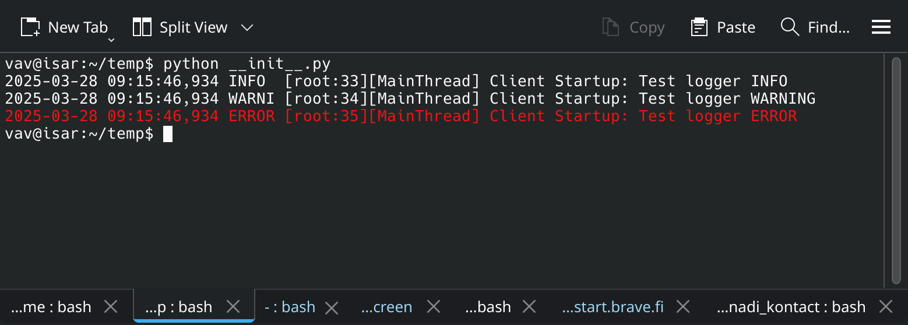
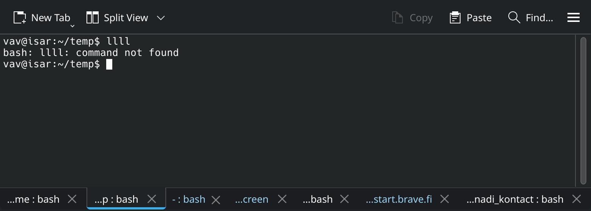
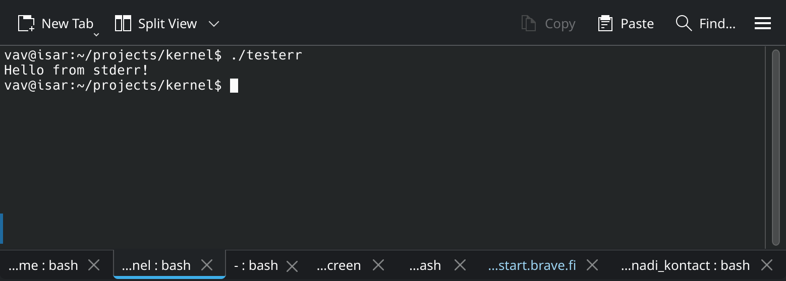

.. _linux.stdout:

Colorize stdout / stderr
========================

.. code-block:: bash

  do_something 2>&1 | tee -a some_file

This command redirects stderr to stdout, sends stdout to some_file, and prints it to stdout.

To make stderr appear in red and stdout in white, you can use the following solution:

.. code-block:: bash

  $ lll  2> >(while read line; do echo -e "\e[01;31m$line\e[0m" >&2; done)
  bash: lll: command not found # THIS WILL BE RED

.. code-block:: bash

  ~$ ll  2> >(while read line; do echo -e "\e[01;31m$line\e[0m" >&2; done)
  output # this will be whit

Another important use case is to check, for example, if the server logs to the correct stdout/stderr.

.. code-block:: bash

  pserver dev.ini 2> >(while read line; do echo -e "\e[01;31m$line\e[0m" >&2; done)

One more way put the function to you .bashrc

.. code-block:: bash

    redstderr() {
    "$@" 2> >(while IFS= read -r line; do echo -e "\e[31m${line}\e[0m" >&2; done)
    }

No it's posible to do

.. code-block:: bash

    # redstderr sada
    bash: sada: command not found <- this is red now.

All these solutions look like workarounds and don't provide a permanent fix. You always have to remember to add this tail to your command.

Some more interesting solution to make stderr red
-------------------------------------------------

1. Write the “red-stderr” interposer code

.. code-block:: C

  #define _GNU_SOURCE
  #include <dlfcn.h>
  #include <unistd.h>
  #include <string.h>

  static ssize_t (*real_write)(int fd, const void *buf, size_t count) = NULL;

  // This function is called automatically when the library is loaded
  __attribute__((constructor))
  static void init(void) {
      // Look up the "real" write() function address from the next library in the chain
      real_write = dlsym(RTLD_NEXT, "write");
  }

  // Our custom write() function that intercepts all writes
  ssize_t write(int fd, const void *buf, size_t count) {
      // If this is stderr (fd=2), wrap the output in red color codes
      if (fd == 2 && count > 0) {
          // ANSI escape codes for red and reset
          const char *red   = "\033[31m";
          const char *reset = "\033[0m";

          // Write the red code, then the original message, then the reset code
          // Note: We ignore error checking for brevity
          real_write(fd, red, strlen(red));
          real_write(fd, buf, count);
          real_write(fd, reset, strlen(reset));

          // We pretend we wrote exactly `count` bytes of "payload"
          return count;
      }
      // Otherwise, it's not stderr or is empty – call the real write
      return real_write(fd, buf, count);
  }

2. Compile the shared library

::
  # export PATHTOFILE=...
  gcc -shared -fPIC -o /$PATHTOFILE/libredstderr.so redstderr.c -ldl

3. Enable it in your shell via .bashrc

::

  export LD_PRELOAD="$PATHTOFILE/libredstderr.so:${LD_PRELOAD}"

This solution works out of the box for Python — Python colors stderr red. But it doesn’t work for C programs or directly in the console.

But stil white in the console

Also C produce white output

::

  // testerr.c
  #include <stdio.h>

  int main() {
      fprintf(stderr, "Hello from stderr!\n");
      return 0;
  }

As you can see this works in special cases, but not always.

Future
------

I also tried creating another version and even a kernel module, but that didn’t work either. It seems the default Debian kernel doesn’t allow this.

For now, Python is enough for me. I’ll come back and try again later.

See also: :ref:`python.log`

Homepage: https://vavpc.de/log_notes_howtos/2025-02-01__stderr_out_python.html
